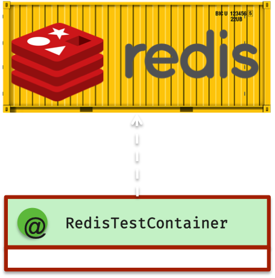
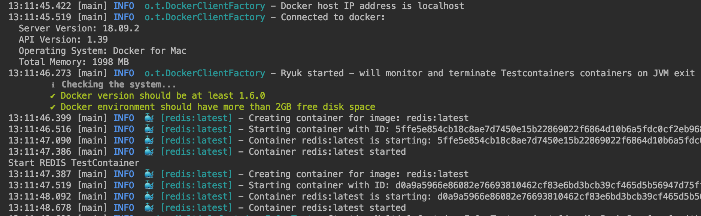

:toc: preamble

# Spring Test Redis

## Overview

## How to write integration tests on Spring Framework with Redis

Add this library in dependencies:

[source,xml]
----
<dependency>
    <groupId>com.jupiter-tools</groupId>
    <artifactId>spring-test-redis</artifactId>
    <version>0.1</version>
</dependency>
----

And now, you can start Redis in docker (TestContainers) by the using of `@RedisTestContainer` annotation in tests:

[source, java]
----
@SpringBootTest
@RedisTestContainer
class RedisTestContainerTest {

    @Autowired
    private RedisTemplate redisTemplate;

    @Test
    void readWriteValueByRedisTemplate() {
        String key = "test";
        String value = "sabracadabra";
        // Act
        redisTemplate.opsForValue().set(key, value);
        // Assert
        assertThat(redisTemplate.opsForValue().get(key)).isEqualTo(value);
    }
}
----

You can use this annotation to start Redis container in tests both with JUnit5 and JUnit4. The implementation doesn't depend on some test framework, just on the Spring Framework.

## How to use multiple Redis containers in the one test case:

[source, java]
----
@SpringBootTest
@RedisTestContainer  <1>
@RedisTestContainer(hostTargetProperty = "my.host", portTargetProperty = "my.port")  <2>
class MultipleContainerInOneTest {

    ...

}
----
<1> start a Redis test container and set a host/port value of started container to default Spring Boot properties (`spring.redis.host` and `spring.redis.port`)
<2> start another Redis container and set a host/port value to specified properties

After test execution you can see something like this in the output:

